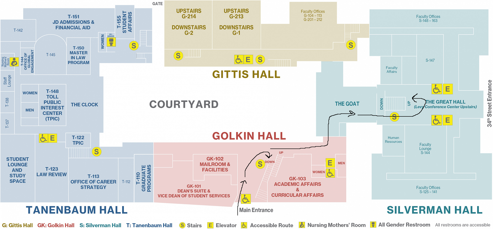
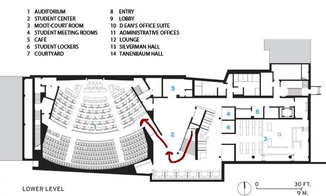
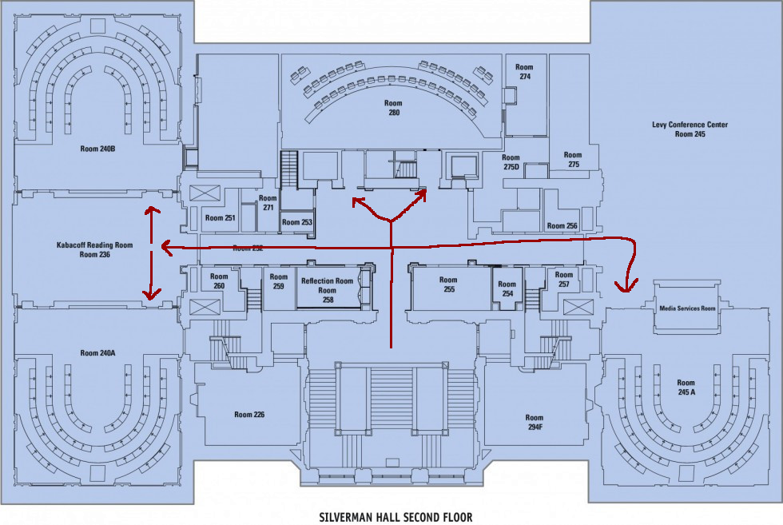

The conference will take place at [UPenn's Carey Law School](https://www.law.upenn.edu/), in Philadelphia, Pennsylvania.

{}

---

## Entrance

{.center}

Please enter at the main entrance to Golkin Hall on Sansom, between 34th and 36th.
You must have some form of valid ID card (not a digital one!) to check in with the security desk just behind this entrance. Registration will be right behind that.

You may choose to bring lunch back to the lounge (marked "The Goat" on the map), or the courtyard.

---

## Golkin Downstairs

{.center}

We will have all morning events, as well as Lawrence Moss's invited lecture and Wednesday's Panel, in the downstairs of Golkin Hall, directly below the entrance lobby.

This includes Fitts Auditorium, as well as the area right outside it, Davis Student Union, where we will have morning coffee breaks.

---

## Silverman Upstairs

We will have special sessions, contributed talks, and afternoon coffee (except on Wednesday, when it will be in Davis Student Union) on the second floor of Silverman Hall. This is accessible from the main entrance by a grand staircase just past The Goat on the [main map](#entrance).

The special session and contributed talks will occur in rooms S-240A, S-240B, S-245A, S-280. Afternoon coffee will take place in the Kabacoff Reading Room, between S-240A and 240-B.

